# 🐛⚡ Bug-Zapper & Chill

<div align="center">

[繁體中文](README.md) · [English](README.en.md) · [日本語](README.ja.md) · [한국어](README.ko.md)

</div>

<div align="center">



**A cyberpunk black-gold hardware console that reflects my GitHub activity in real time**
*(If the image above hasn't shown up yet, the [HUD Updater](.github/workflows/hud-updater.yml) hasn't run for the first time yet.)*

</div>

---

## What is this?

`Bug-Zapper & Chill` is a fully original GitHub Profile dynamic dashboard project. Every day it automatically:

1. Fetches the past 365 days of Contribution Calendar stats via the GitHub GraphQL API v4.
2. Hand-assembles native SVG using pure Python string formatting (**no** matplotlib / Pillow or any other drawing library).
3. Generates a `profile-hud.svg` depicting two hardware core components side by side:

| Component | Description |
|---|---|
| 🧪 **Overheating Liquid Cooling Loop** | A rectangular-loop reservoir connected to a CPU water block. The coolant level, rising bubble animation, and the PUMP SPEED / COOLANT TEMP / SYS PRESSURE readouts all change dynamically based on today's commit count (`24°C [STANDBY]` ~ `84°C [OVERCLOCK]`). |
| ⚡ **EM Bug Interception Tower** | A cone-shaped defense tower that fires lightning bolts. Every day it computes "bugs destroyed today" from your commit count, zapping a struggling yellow bug and a `NullPointer` exception along the way. |

The whole image is regenerated and committed back to `main` automatically every day by [GitHub Actions](.github/workflows/hud-updater.yml) — no manual maintenance required.

---

## Project Structure

```
Bug-Zapper-Chill/
├── src/generate_hud.py             # Core: fetch data + hand-assemble SVG
├── profile-hud.svg                 # Auto-generated output (overwritten daily by the workflow)
├── .github/workflows/hud-updater.yml   # Daily scheduled automation workflow
└── README.md
```

---

## How to Use It on Your Own Profile

1. **Create a Personal Access Token (classic)** with at least `read:user` scope (also add `repo` if the target repository is private).
2. In this repo, go to **Settings → Secrets and variables → Actions** and add a repository secret named `GH_PAT` with that token.
3. (Optional) To track a different user, change the `HUD_USERNAME` environment variable in the workflow (default is `MikeYC-Wang`).
4. Manually trigger **Actions → HUD Updater → Run workflow** once to confirm `profile-hud.svg` is generated and committed correctly.
5. After that, it refreshes automatically every 2 hours (UTC 0, 2, 4, ... 22), so the dashboard reflects today's commits more promptly.

To embed this image in your own personal profile README (the `<username>/<username>` repo), reference the raw SVG produced by this repo directly:

```markdown

```

---

## Local Testing

```bash
pip install requests
set GH_PAT=ghp_xxxxxxxxxxxxxxxxxxxx      # PowerShell: $env:GH_PAT="ghp_xxx"
set HUD_USERNAME=MikeYC-Wang
python src/generate_hud.py
```

On success, `profile-hud.svg` will be generated in the project root.

---

## Technical Highlights

- **Zero drawing dependencies**: Every visual element (loop tubing, glow filters, gradients, lightning zigzags) is hand-assembled native `<svg>` tag strings — no raster images or third-party drawing libraries.
- **Dynamically linked data**: The cooling system's and defense tower's values are all computed live from "today's commit count" rather than hard-coded static numbers.
- **Fail loudly, never fake it**: If data fetching fails, the script immediately exits with a non-zero status code instead of generating a misleading HUD with fake data.

---

## License

This project is released under the [MIT License](LICENSE) — free to use, modify, and redistribute, provided the original copyright notice is retained.

---

<div align="center">

**ENGINEER: MikeYC-Wang** · SYSTEM STATUS: ONLINE

</div>
